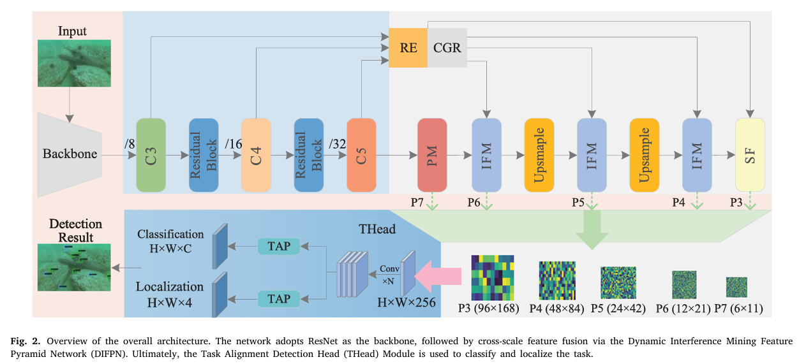
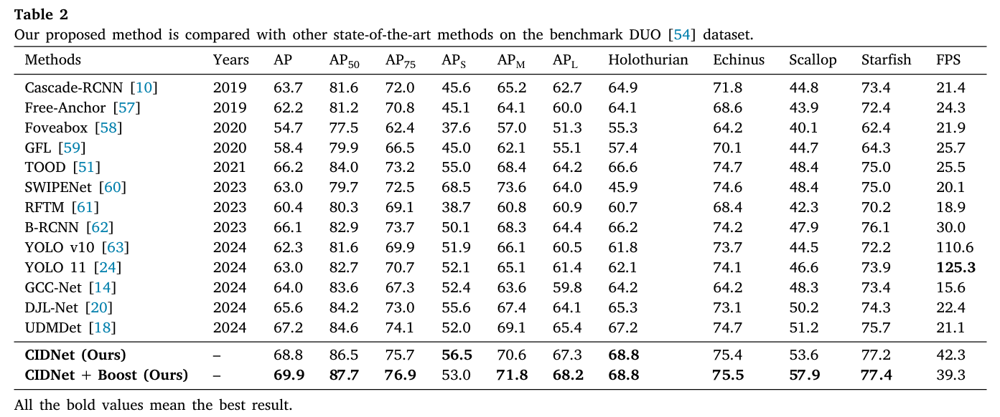

# CIDNet: Cross-Scale Interference Mining Detection Network for underwater object detection

This repository contains the official PyTorch implementation of our paper accepted by Knowledge-Based Systems (KBS).

If you use this code, please cite our paper, and hit the star at the top-right corner. Thanks!
## Introduction
Underwater object detection plays a crucial role in advancing marine economics, protecting the environment, 
and promoting the planet’s sustainable development. Compared to land-based scenes, underwater object 
detection is often hindered by color deviation and low visibility. To effectively address these interference issues, 
we propose a Cross-Scale Interference Mining Detection Network (CIDNet). We first extract multidimensional 
feature representations from the input images using a standard residual network backbone, which uses a 
deep structure and residual connectivity mechanism. We then refine these features through interference 
mining and cross-scale feature fusion strategies, and further enhance feature hierarchy levels using adaptive 
feature mapping optimization. In addition, we introduce three-dimensional convolution combination with 
a channel dimension unification strategy to enhance the fine-grained representation of hierarchical feature 
layers. Finally, the refined features are fed into a Task-aligned detection head module, which improves the 
detection accuracy by optimizing a collaboration between classification and localization tasks through a task
aligned learning strategy. Extensive experiments conducted on the DUO and COCO datasets demonstrate that 
our method effectively detects hidden objects in realistic underwater scenes and significantly outperforms 
current state-of-the-art methods in terms of accuracy. The codes and model weights will be available at 
https://www.researchgate.net/publication/390270613_CIDNet.



## Dependencies

- Python == 3.7.11
- PyTorch == 1.10.1
- mmdetection == 2.22.0

## Installation

The basic installation follows with [mmdetection](https://github.com/mousecpn/mmdetection/blob/master/docs/get_started.md). It is recommended to use manual installation. 

## Datasets

**DUO**: https://github.com/chongweiliu/DUO


Other underwater datasets: https://github.com/mousecpn/Collection-of-Underwater-Object-Detection-Dataset

After downloading all datasets, create CIDNet document.

```
$ cd data
$ mkdir CIDNet
```

It is recommended to symlink the dataset root to `$data`.

```
CIDNet
├── data
│   ├── DUO
│   │   ├── annotaions
│   │   ├── train2017
│   │   ├── test2017
│   ├── COCO
│   │   ├── annotaions
│   │   ├── train2017
│   │   ├── val2017
```


## Train

```
We provide multiple training strategies for users to choose from, offering flexibility for different application scenarios.
$ python tools/train.py configs/CIDNet/XXX
```


## Results




## Acknowledgement

Thanks MMDetection team for the wonderful open source project!

## Citation

```
@article{ZHAO2025113902,
title = {CIDNet: Cross-Scale Interference Mining Detection Network for underwater object detection},
journal = {Knowledge-Based Systems},
volume = {324},
pages = {113902},
year = {2025},
issn = {0950-7051},
doi = {https://doi.org/10.1016/j.knosys.2025.113902},
url = {https://www.sciencedirect.com/science/article/pii/S0950705125009487},
author = {Gaoli Zhao and Kefei Zhang and Liangzhi Wang and Wenyi Zhao and Weidong Zhang}}
```

